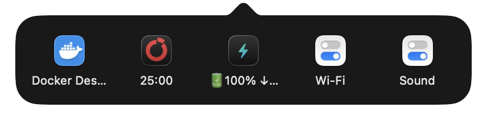

# TrayFold

A Windows-style system tray for the macOS menu bar, built for MacBooks with a notch. Accessibility permission only: no Screen Recording, no network.

> **Status: pre-release (0.1.0).** The core loop works: fold icons away, open the tray, click an entry to get that app's real menu. It has been tested on one Mac so far (see [Known limitations](#known-limitations)).

<p></p>

## The problem

On a notched MacBook, macOS quietly hides menu bar icons that don't fit beside the notch. There's no overflow arrow and no hint: the app is running, but you can't see or click it.

Existing fixes either show hidden icons back in the same cramped bar, cost money, or need the **Screen Recording** permission to draw icons in a separate panel, with the capture indicator that comes with it.

## How it works

TrayFold puts two things in your menu bar: a chevron (⌄) and, to its left, a thin divider.

- **Fold icons away:** right-click ⌄ → **Show Hidden Icons**, then **⌘-drag** any icon to the left of the divider. Click anywhere below the menu bar (or choose **Hide Icons**) and the divider widens, pushing those icons off-screen.
- **Open the tray:** left-click ⌄. A popup lists every icon you can't see right now, whether folded away, stuck under the notch, or off-screen, in menu bar order. Each entry shows the app's icon and a short label (the item's own text, such as a timer's "25:00", when it has one).
- **Use an icon:** click an entry. TrayFold unfolds just enough of the bar to bring that icon on-screen, clicks it for you through Accessibility, and its real menu (or panel, or window) opens in the usual place, about 150 ms after your click. When the menu closes, the bar folds back.
- **Menu:** right-click (or ⌃-click) ⌄ for **Show Hidden Icons** / **Hide Icons** and **Quit TrayFold**.
- **Safety net:** while icons are shown, the first click below the menu bar folds them away again. If the chevron ever disappears on a crowded bar, click anywhere below the menu bar, or open TrayFold again (for example from Spotlight): reopening it folds everything back.

TrayFold doesn't redraw or replace your menu bar. The divider is an ordinary menu bar item that changes width; the icons you fold away stay where you put them, and quitting TrayFold removes the divider, so they reappear.

## Permissions

**Accessibility, and nothing else by default.** TrayFold uses it to:

- read which menu bar items exist and where they are, so the tray can list the hidden ones;
- press an item (the same thing a click does) so its menu opens.

On first launch macOS asks whether to allow it. Until you do, TrayFold shows a warning triangle (⚠) instead of the chevron: click it → **Allow Accessibility Access…**, then turn TrayFold on in **System Settings → Privacy & Security → Accessibility**. The chevron appears as soon as it's allowed.

### Live icons (optional, off by default)

Right-click ⌄ → **Show Live Icons** makes the tray show each item's real menu bar image (Docker's status, a timer's digits) instead of its app icon. This is the only feature that needs **Screen Recording**: TrayFold asks for it only when you turn the option on, and never uses it while it's off.

macOS can only capture an icon while it's on the screen, so TrayFold captures an item when you open it from the tray (or when the tray opens while icons are shown) and remembers the image; until then you see the app icon. Each capture makes macOS show a small purple dot next to Control Center for a few seconds, and macOS may ask about once a month whether TrayFold may keep recording. Captured images stay in memory only and are never saved or sent anywhere.

## Privacy

- **No network.** No updater, no telemetry, no analytics, no crash reporter. TrayFold contains no networking code.
- **No data collection.** Nothing is written anywhere except TrayFold's preferences (such as where the divider sits) and the system log.
- **Logs stay on your Mac** and name apps by bundle id (like `com.docker.docker`), never by what their menu items say.

To check for yourself:

```sh
# No networking APIs in the source:
grep -rnE --include="*.swift" "URLSession|NWConnection|import Network|CFSocket|http" TrayFold/
# No open sockets while it runs:
lsof -a -i -c TrayFold
```

Both print nothing. The whole app is under 1,000 lines of Swift code with no third-party dependencies, small enough to read in an evening.

## Install

### Download

Grab `TrayFold-<version>.zip` from the [latest release](https://github.com/rezaahmadn/TrayFold/releases/latest), unzip it, and move `TrayFold.app` to `/Applications`.

The app is ad-hoc signed and not notarized (there is no paid Apple Developer account behind it), so macOS blocks the first launch with a message that it can't check the app for malware. Either:

1. Try to open it once, then go to **System Settings → Privacy & Security**, scroll down, and click **Open Anyway** next to the TrayFold message; or
2. In Terminal: `xattr -dr com.apple.quarantine /Applications/TrayFold.app`

After that it opens normally. Then allow Accessibility as described above. (The old right-click → **Open** shortcut no longer skips this check on macOS 15 and later; use Open Anyway.)

Each downloaded version is a new app as far as macOS is concerned, so after updating you may have to allow Accessibility again: in the Accessibility list, remove the old TrayFold entry (−) and turn on the new one.

### Build from source

Requires Xcode 26 on macOS 26.

```sh
git clone https://github.com/rezaahmadn/TrayFold.git
cd TrayFold
Scripts/run.sh          # builds (Debug) and launches; or open TrayFold.xcodeproj and press ⌘R
```

Builds you make yourself are not quarantined, so they open directly.

**Keep the permission across rebuilds (recommended).** Default builds are ad-hoc signed, so macOS forgets the Accessibility permission every time you rebuild. Run once:

```sh
Scripts/setup-signing.sh
```

It creates a self-signed "TrayFold Local Signing" certificate in your login keychain (macOS asks for your password to trust it) and a git-ignored `Config/Signing.local.xcconfig` that uses it.

## Known limitations

- **One click action per item.** Clicking an entry does what a left-click on that icon does. Apps that keep their menu on right-click only (some open their main window on left-click instead) give you the left-click action.
- **Other menu bar managers.** Thaw, Ice, Bartender, Hidden Bar and similar tools move the same icons around. Quit them before using TrayFold.
- **macOS 27** replaced the menu bar with a single window and added its own overflow button. The divider trick may not work there; TrayFold targets macOS 26.
- **Tested on one Mac:** a 14-inch MacBook Pro with its built-in notched display, macOS 26.7. External and multiple displays are untested (TrayFold assumes the main display).
- **Battery** hasn't been tested (it isn't in the test Mac's menu bar). Other Control Center items work: Wi-Fi and Sound fold away, and Sound's panel opens from the tray.
- **Quitting TrayFold** shows every folded icon again until it runs again.

Found something else? [Open an issue](https://github.com/rezaahmadn/TrayFold/issues/new/choose): the bug form asks for what helps.

## Requirements

- macOS 26 (Tahoe).
- Made for notched Apple silicon MacBooks. Other Macs with a crowded menu bar may benefit too, but are untested.

## Contributing

Bug reports and small, focused pull requests are welcome. See [CONTRIBUTING.md](CONTRIBUTING.md) for build and test commands and the few rules TrayFold keeps (no network, no new default permissions, stay small).

## License

[MIT](LICENSE)
